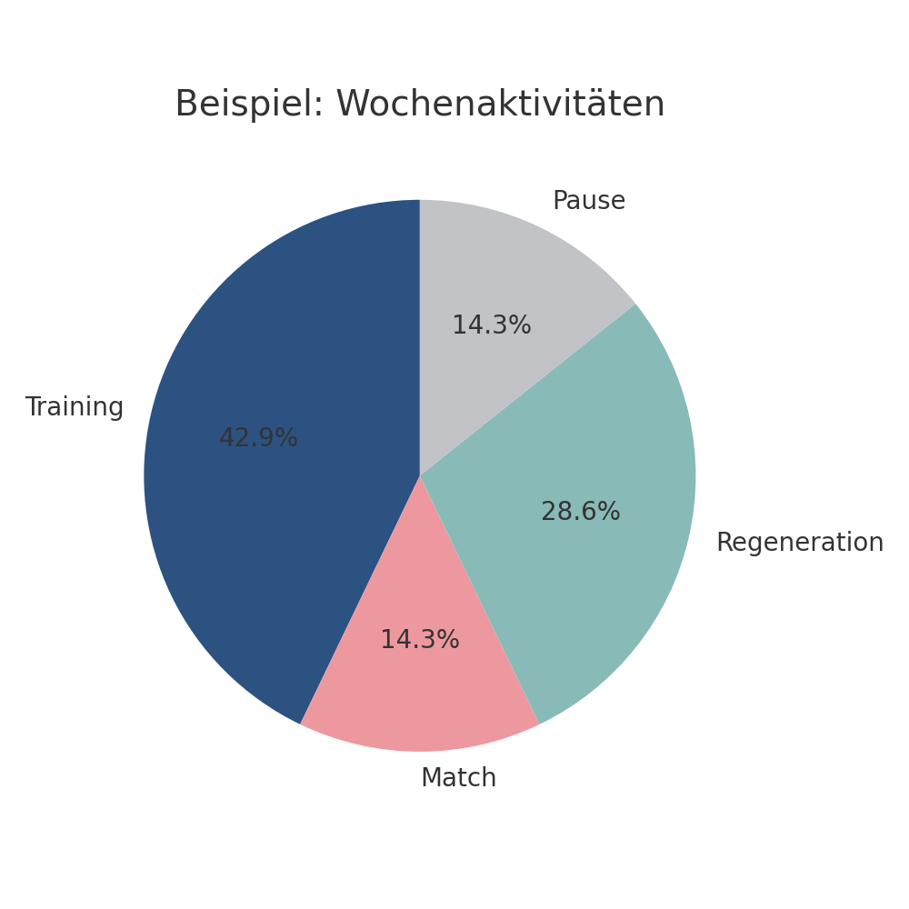
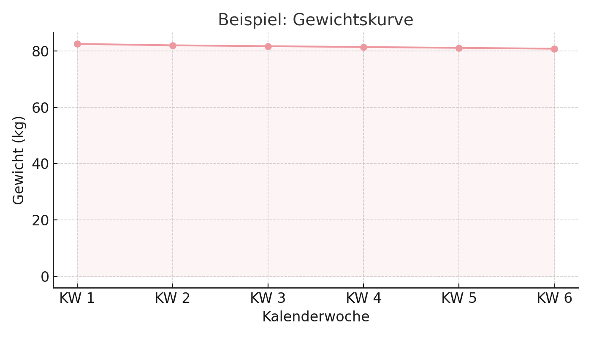

# 📘 Anwenderdokumentation

## 🧠 Trainingsphasen
...

## 🧰 Funktionen & Symbole
...

## 📊 Fortschritt

### ✅ Wöchentlicher Fokus (Kreisdiagramm)

Zeigt die prozentuale Verteilung der Aktivitäten einer Woche. Beispiel:

### 📈 Gewichtskurve

Visualisiert deinen Gewichtsverlauf über mehrere Wochen.

---

## 🧩 Modale Fenster (Details)

| Modal-ID                | Beschreibung                                                                 |
|--------------------------|------------------------------------------------------------------------------|
| `#exercise-modal`        | Anzeige von Details zur Einheit des gewählten Tages, inkl. Kommentar & Gewicht |
| `#add-training-modal`    | Erstellen oder Bearbeiten einer Trainingseinheit für einen Tag               |
| `#import-export-modal`   | Sicherung (Export) oder Wiederherstellung (Import) des gesamten Trainingsplans |
| `#confirm-modal`         | Sicherheitsabfrage für kritische Aktionen wie das Löschen einer Woche       |

---

# ⚙️ Technische Dokumentation

## 📁 Projektstruktur
...

## 🏗️ Datenmodell
...

## 🧩 Hauptfunktionen (JS-Logik)
...

## 🖼️ UI Struktur (hierarchisch)
...

## 📊 Chart-Konfiguration
...

## 🛡️ Speicherung & Backup
...
